# 번들 사이즈 최적화를 통한 웹 성능 최적화

### 번들 사이즈가 웹 사이트에 미치는 영향

웹 사이트가 복잡해지면서 번들 사이즈도 함께 증가하는 경향이 있습니다. 특히 사용자 경험을 강화하기 위해 다양한 기능과 복잡한 인터페이스를 추가하면서 자바스크립트, CSS, 이미지 등의 리소스 크기가 커지는 문제가 발생합니다. 이로 인해 초기 로딩 시간이 길어지고, 이는 사용자 경험과 웹 사이트 성능에 부정적인 영향을 미칩니다.

[KissMetrics 연구 결과](https://neilpatel.com/blog/loading-time/)에 따르면 페이지 로드 시간이 1초씩 길어질 때마다 웹 페이지 이탈률이 7%씩 증가한다고 합니다. 전자상거래 사이트의 경우, 이는 매출 감소로 이어질 수 있습니다. 사용자는 로딩 시간이 길어지면 페이지를 떠날 가능성이 높아지고, 특히 구매 과정에서 지연이 발생하면 구매를 포기할 확률이 증가합니다. 실제로 대형 전자상거래 사이트에서 [로딩 속도가 1초만 느려져도 매출에 심각한 영향을 받을 수 있다는 연구 결과](https://www.akamai.com/resources/white-paper/how-web-and-mobile-performance-optimize-conversion-and-user-experience)가 있습니다.

번들 사이즈 최적화를 통해 이러한 문제를 해결할 수 있습니다. 불필요한 코드를 제거하고, 필요한 자원만 즉시 로드할 수 있도록 코드를 최적화하면 네트워크 요청 시간을 줄일 수 있습니다. 이를 통해 초기 로딩 속도를 개선하고, 사용자 이탈률을 낮출 수 있습니다. 번들 사이즈를 줄임으로써 FCP(First Contentful Paint)와 LCP(Largest Contentful Paint) 등의 성능 지표도 개선될 수 있습니다. 결과적으로 번들 사이즈 최적화는 더 나은 사용자 경험을 제공하고 SEO 성능까지 향상시킬 수 있습니다.


## 번들 사이즈 및 성능을 확인하는 방법

번들 사이즈와 웹 사이트 성능을 확인하는 방법으로는 여러 가지가 있지만, 그중 가장 기본적인 방법은 크롬 개발자 도구를 사용하는 것입니다. 이 도구는 웹 페이지의 성능을 분석하고 번들 크기를 줄이기 위한 최적화 작업을 쉽게 수행할 수 있게 해줍니다.

### 개발자 도구 (F12)

크롬 개발자 도구는 네트워크 요청, 리소스 로딩 시간, 자바스크립트 실행 상태 등 웹 성능과 관련된 다양한 데이터를 시각적으로 제공해줍니다. 이를 통해 웹 페이지의 로딩 속도를 저해하는 요인들을 파악하고 개선할 수 있습니다.

**네트워크 탭**
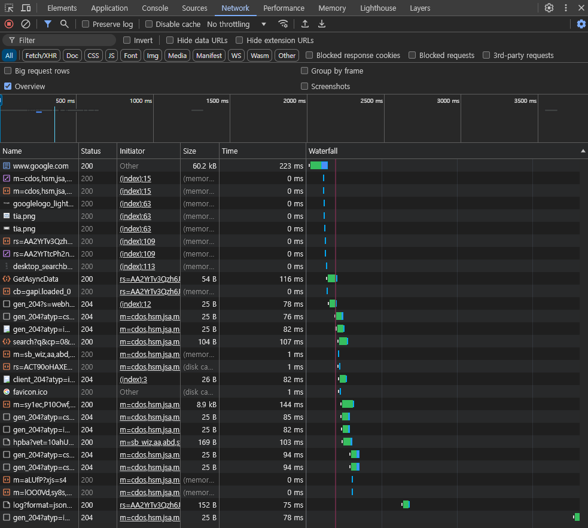

네트워크(Network) 탭에서는 페이지가 로드되는 동안 발생하는 모든 네트워크 요청을 확인할 수 있습니다. 이 탭을 사용하면 웹 사이트가 로딩 중인 API 호출, 데이터 요청, 그리고 번들 파일을 포함한 모든 리소스를 분석할 수 있습니다. 각 요청의 크기와 응답 시간을 상세히 제공하기 때문에 불필요하게 큰 번들이나 느린 API 응답으로 인한 성능 저하를 쉽게 파악할 수 있습니다.

**Performance 탭**

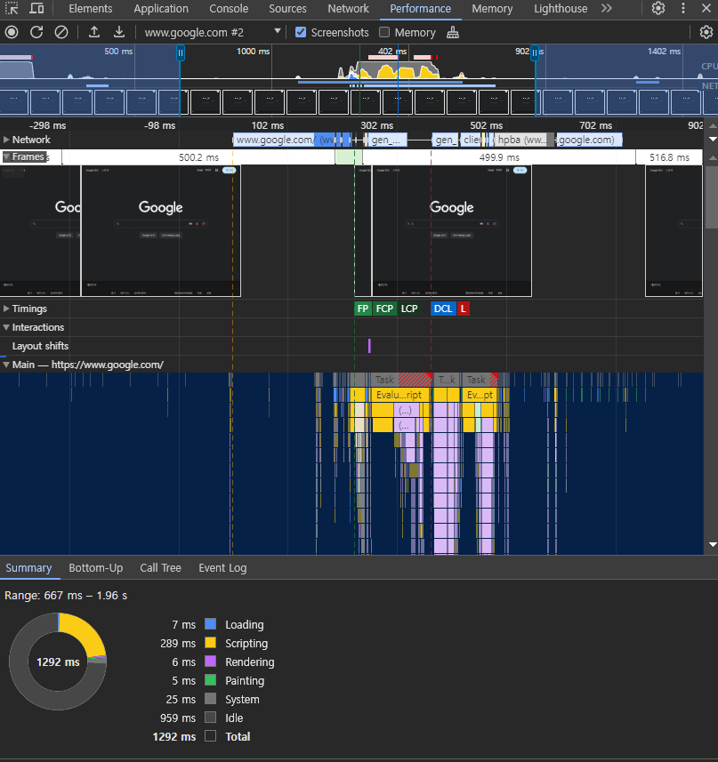

Performance 탭은 웹 페이지의 성능을 더욱 정밀하게 분석할 수 있는 도구입니다. 특정 시점의 이벤트들을 확인하여 렌더링, 페인트, 레이아웃 계산 등 다양한 단계에서 발생하는 성능 저하를 감지할 수 있습니다. 이를 통해 웹 사이트가 어떻게 렌더링되고 있는지, 그리고 번들 크기나 코드의 복잡성이 성능에 어떤 영향을 미치는지 자세히 분석할 수 있습니다.

**Coverage 탭**

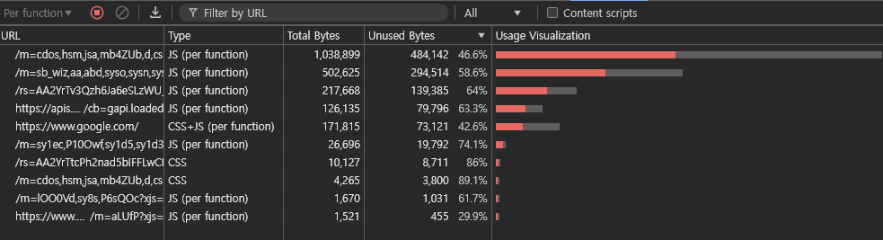

Coverage 탭은 웹 페이지에서 실제로 사용된 코드와 사용되지 않은 코드를 색상으로 구분해 보여줍니다. 이를 통해 불필요한 코드를 식별하고 제거하여 번들 사이즈를 줄일 수 있습니다.


### Lighthouse


Lighthouse는 구글에서 제공하는 오픈소스 자동화 도구로, 웹 사이트의 성능과 접근성, SEO, 프로그레시브 웹 앱(PWA) 지원 여부 등을 종합적으로 분석할 수 있습니다. 특히 웹 성능과 관련된 리포트를 제공하기 때문에 웹 사이트가 얼마나 빠르고 효율적으로 동작하는지 확인하는 데 유용합니다. 크롬 웹 스토어에서 설치하여 크롬 개발자 도구 내에서 실행할 수 있습니다.

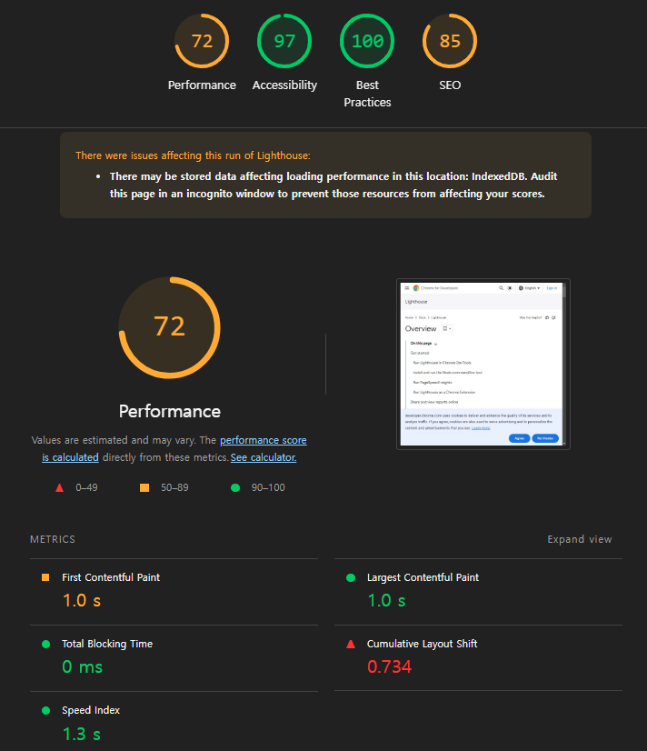

### Webpack Bundle Analyzer

Webpack Bundle Analyzer는 Webpack 번들의 크기를 시각적으로 분석하고 최적화할 수 있는 도구입니다. 이 도구는 번들의 구조를 트리 맵(tree map) 형태로 보여주어, 어떤 모듈이 가장 많은 용량을 차지하는지, 중복된 모듈이 있는지 등을 쉽게 파악할 수 있도록 도와줍니다. 이를 통해 불필요하게 번들 사이즈를 크게 만드는 원인을 찾아내어 번들 최적화 작업을 효율적으로 진행할 수 있습니다.

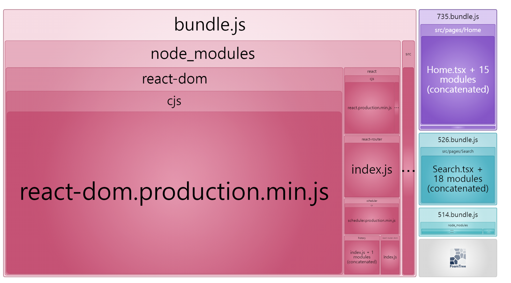

다음의 명령어를 통해 설치한 뒤, 프로젝트의 Webpack 설정에 코드를 추가합니다.
```bash
# NPM
npm install --save-dev webpack-bundle-analyzer
# Yarn
yarn add -D webpack-bundle-analyzer
```

```js
// webpack.config.js

const BundleAnalyzerPlugin = require('webpack-bundle-analyzer').BundleAnalyzerPlugin;

module.exports = {
  plugins: [
    new BundleAnalyzerPlugin()
  ]
}
```

자세한 옵션은 [webpack-bundle-analyzer github](https://www.npmjs.com/package/webpack-bundle-analyzer)에서 확인할 수 있습니다.


## 번들 사이즈 최적화의 주요 기법

### Webpack mode 설정

React에서 Webpack을 번들러로 사용하는 경우 번들 최적화를 위해 mode를 적절하게 지정하는 것이 중요합니다. [Webpack 공식 문서](https://webpack.js.org/configuration/mode/)에 따르면, Webpack의 mode 옵션은 크게 `development`, `production`, `none` 세 가지가 있습니다. 기본값으로는 `production`이 지정되고, source-map 등 개발에 쓰이는 요소들이 필요한 경우 `development`로 지정할 수 있습니다.

production 모드를 활성화하면 Webpack은 코드 압축, 최적화 플러그인 적용, Tree Shaking(불필요한 코드 제거) 등의 작업을 자동으로 진행합니다. Webpack 버전 5부터는 [TerserWebpackPlugin](https://webpack.js.org/plugins/terser-webpack-plugin/)이 내장되어 있어 추가적인 설정 없이도 자바스크립트 코드가 난독화되고 최적화됩니다.


**`development` 모드와 `production` 모드 비교**

다음은 동일한 프로젝트를 `development` 모드와 `production` 모드에서 빌드한 결과를 비교한 사례입니다.

먼저 `development` 모드에서 빌드한 프로젝트 코드를 살펴보겠습니다.

```js
// webpack.config.js

module.exports = {
  mode: 'development',
	// ... 생략
};
```

이 모드에서는 코드가 최적화되지 않으며 소스 맵(source map)이 포함되어 디버깅에 도움이 됩니다. 또한, 핫 리로딩 기능 등 개발 중 필요한 기능들이 활성화됩니다. 그러나 최종 배포용으로는 적합하지 않으며 번들 크기가 매우 커질 수 있습니다.


Webpack Bundle Analyzer에서 확인한 모습은 다음과 같습니다. 

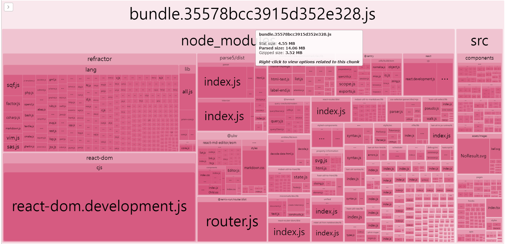

위 이미지는 Webpack Bundle Analyzer로 development 모드에서 빌드한 번들 구조를 시각화한 결과입니다. 14.06MB의 큰 번들 파일을 확인할 수 있으며, 이는 권장하는 크기(약 244KB) 보다 약 50배 이상 초과합니다.


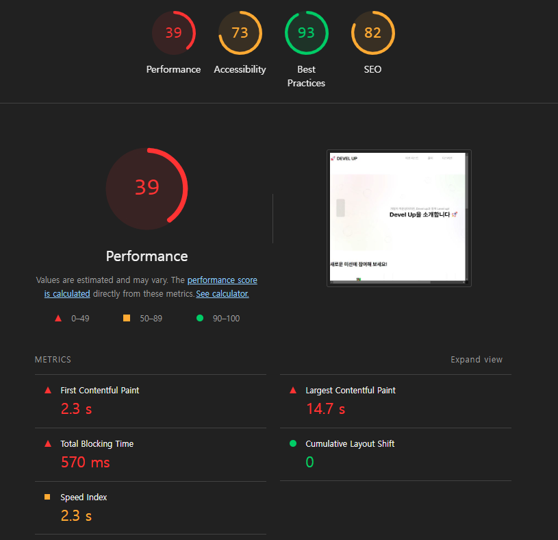

또한, S3와 CDN으로 배포 후 Lighthouse로 측정한 성능 지표에서도 Performance 수치가 매우 낮게 나왔습니다. 번들 사이즈가 매우 크기 때문에 LCP 및 TBT(Total Blocking Time)와 같은 주요 성능 지표가 크게 저하되었습니다.

다음으로 `production` 모드에서 프로젝트 코드를 빌드한 결과를 살펴보겠습니다.

```js
// webpack.config.js

module.exports = {
  mode: 'production',
	// ... 생략
};
```

production 모드에서는 Webpack이 자동으로 최적화를 수행하여 번들 크기를 줄입니다. 압축과 난독화, Tree Shaking 등이 적용되어 더 작은 번들이 생성됩니다.


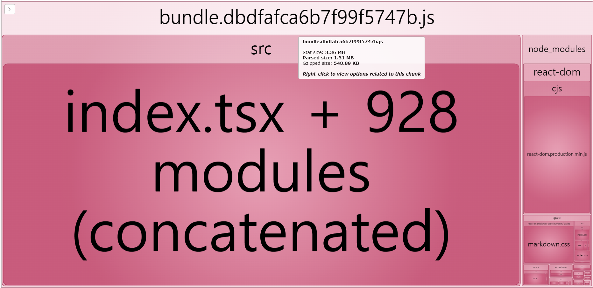

Webpack Bundle Analyzer로 분석한 결과, 번들 크기는 1.51MB로 development 모드와 비교했을 때 약 14배 감소했습니다.


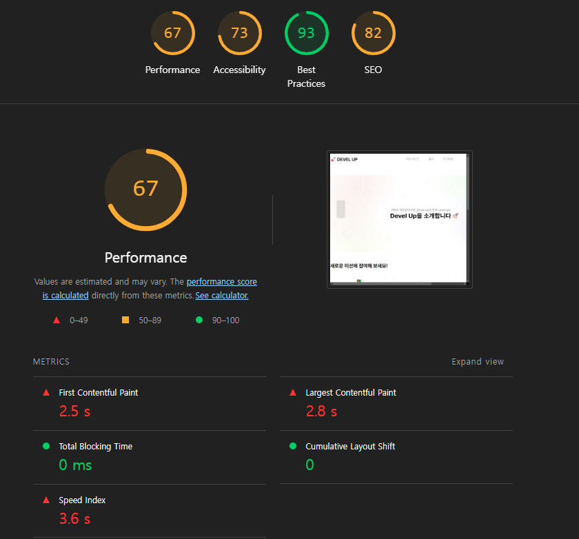

Lighthouse로 측정한 성능 지표도 개선되었습니다. Performance 점수가 39점에서 67점으로 상승했으며, 특히 LCP와 TBT가 크게 감소하여 웹 페이지의 초기 로딩 성능이 개선되었습니다. 번들 크기가 줄어듦에 따라 사용자가 더 빠르게 웹 페이지를 볼 수 있고, 상호작용도 빨라졌습니다.

 Webpack을 `production` 모드로 설정하면 번들 사이즈가 크게 줄어들고 성능이 향상됩니다. 이를 통해 웹 성능 최적화와 사용자 경험에 긍정적인 영향을 미칩니다. 따라서 배포 환경에서는 `production` 모드를 사용하여 빌드하는 것이 좋습니다.


### CSS 최적화

CSS 최적화는 CSS 파일의 크기를 줄여 웹 페이지 로딩 시간을 단축하는 역할을 합니다. 파일 크기를 줄이기 위해 공백과 주석, 불필요한 코드 등을 제거합니다. 또한, CSS 코드를 재구성하여 불필요한 코드의 중복을 막기도 합니다.

Webpack 설정 시 `mini-css-extract-plugin`과 `css-minimizer-webpack-plugin`을 사용하여 자바스크립트 뿐만 아니라 CSS도 최적화할 수 있습니다. 

```tsx
const MiniCssExtractPlugin = require('mini-css-extract-plugin');
const CssMinimizerPlugin = require('css-minimizer-webpack-plugin');

module.exports = {
  mode: 'production',
  module: {
    rules: [
      {
        test: /\.css$/i,
        use: [MiniCssExtractPlugin.loader, 'css-loader'],
      },
    ],
  },
  plugins: [
    new MiniCssExtractPlugin(), // CSS를 별도 파일로 추출
  ],
  optimization: {
    minimizer: [
      '...', // 기본 TerserWebpackPlugin을 유지하기 위해 스프레드 연산자 사용
      new CssMinimizerPlugin(), // CSS 파일 최소화
    ],
  },
};
```

`mini-css-extract-plugin`으로 번들에서 CSS를 별도의 파일로 추출하고, `css-minimizer-webpack-plugin`을 통해 CSS 파일을 최소화합니다.

이때, 주의할 점은 `minimizer` 설정에서 스프레드 연산자 `'...'`를 추가해야 한다는 것입니다. Webpack은 기본적으로 자바스크립트 파일을 최적화하기 위해 `TerserWebpackPlugin`을 내장하고 있습니다. 이 플러그인을 유지하면서 `CssMinimizerPlugin`을 추가하기 위해서는 스프레드 연산자를 사용해야 합니다. 스프레드 연산자를 사용하지 않으면 기본 자바스크립트 최적화 플러그인이 덮어쓰여지고, CSS 최적화만 적용될 수 있기 때문에 주의해야 합니다.

**CSS 최적화 결과 분석**

CSS 최적화 전후의 번들 사이즈를 비교해 보겠습니다.


CSS 최적화 전에는 `production` mode로 빌드했을 때, 파싱된 번들 사이즈가 **1.51MB**였습니다.

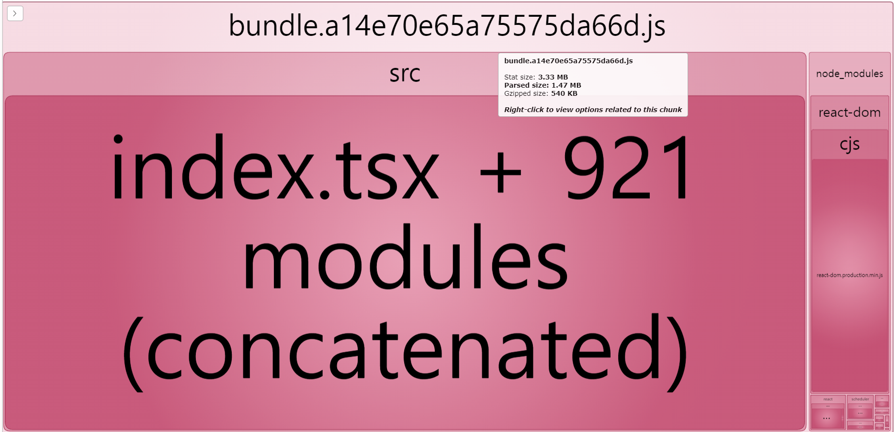

CSS 최적화 후 같은 방법으로 빌드했을 때, 번들 사이즈는 **1.47MB**로 감소했습니다. 최적화 과정에서 CSS 파일이 별도로 분리되었고, 0.04MB 크기의 CSS 파일이 번들에서 제외되었습니다. 이를 통해 전체 번들 사이즈가 조금 줄어들었습니다.

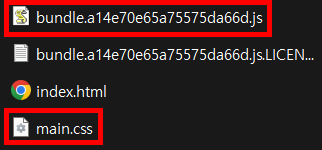


**번들 사이즈 감소율**

최적화 전후의 번들 크기를 정리한 표는 다음과 같습니다.

| CSS 최적화 전 | CSS 최적화 후 | 감소율 |
|---------------|---------------|---------|
| 1.51MB        | 1.47MB        | 2.65%   |

**성능 지표 분석**

WebpageTest에서 측정한 결과, TTFB(Time To First Byte), FCP, SI(Speed Index), LCP 등의 Web Core Vitals 지표는 거의 변화가 없었습니다. 번들 크기가 약간 줄어들었지만, 감소율이 **2.65%** 에 불과해 실질적인 성능 향상은 미미했습니다.
|   | 이미지 |
|----|--------|
|  WebpageTest CSS 최적화 전  | 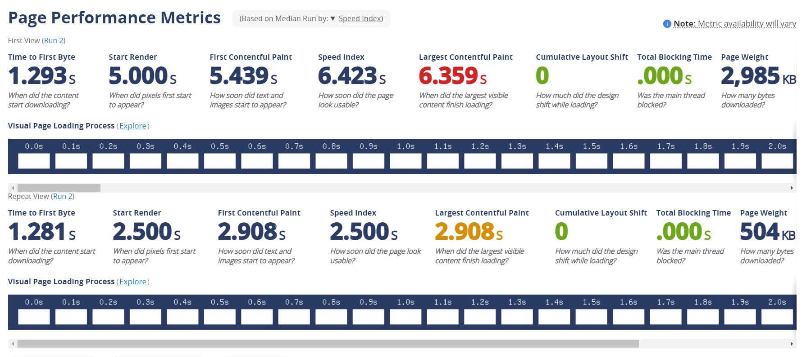 |
| WebpageTest CSS 최적화 후  | 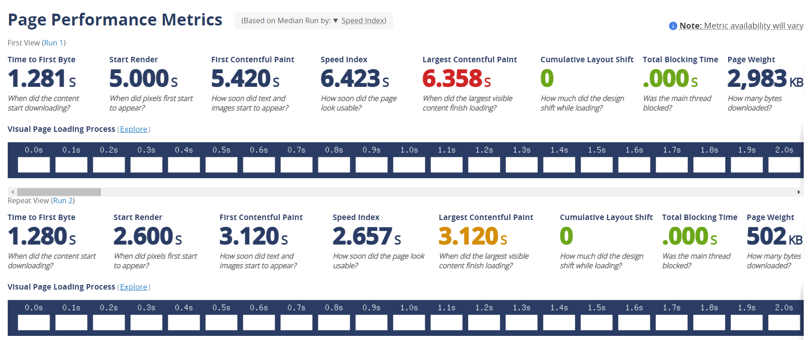 |


### 코드 스플리팅 (Code Splitting)

더 큰 성능 개선 효과를 얻고 싶다면 코드 스플리팅 작업을 이용할 수 있습니다.

1. 코드 스플리팅과 Lazy Loading

2. 코드 스플리팅 적용

3. 코드 스플리팅이 성능에 미치는 영향


## 결론
- 번들 사이즈 최적화의 핵심 요약 및 앞으로의 방향

### 참고 자료
- https://developer.chrome.com/docs/lighthouse/overview?hl=ko
- https://react.dev/reference/react/Suspense
- https://react.dev/reference/react/lazy
- https://webpack.kr/guides/code-splitting/
- 참고 서적 : 프론트엔드 성능 최적화 가이드
- https://developer.chrome.com/docs/lighthouse/overview?hl=ko